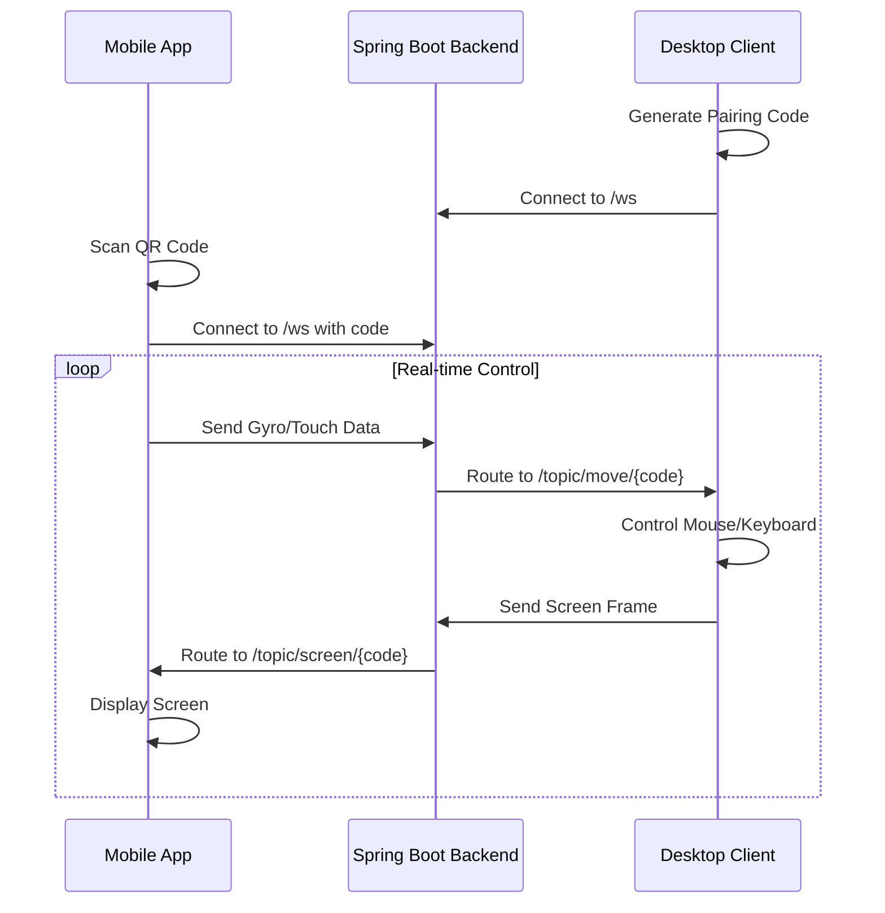

<div align="center">

# 🚀 Axilink

### Transform Your Smartphone into a Wireless Desktop Controller
[](https://www.youtube.com/watch?v=jjw0VxjGHvM)

[](https://flutter.dev/)
[](https://spring.io/projects/spring-boot)
[](https://www.python.org/)

[](https://stomp.github.io/)

[Features](#-key-features) • [Demo](#-demo) • [Architecture](#-system-architecture) • [Installation](#-installation) • [Usage](#-usage) • [Roadmap](#-roadmap)

</div>

---

## 📋 Table of Contents

- [Overview](#-overview)
- [Key Features](#-key-features)

- [System Architecture](#-system-architecture)
- [Technology Stack](#-technology-stack)
- [Installation](#-installation)
- [Usage](#-usage)
- [How It Works](#-how-it-works)
- [Project Structure](#-project-structure)
- [Roadmap](#-roadmap)
- [Use Cases](#-use-cases)
- [Contributing](#-contributing)


---

## 🌟 Overview

**Axilink** is a cutting-edge cross-platform system that transforms your smartphone into a powerful wireless desktop controller with real-time screen mirroring and touch-based interaction. Say goodbye to physical input devices and hello to seamless, low-latency interaction between mobile and desktop systems.

### 🔤 Name Origin

- **Axis**:  Represents the smartphone's gyroscope axes used for motion-based control
- **Link**: Represents the real-time wireless connection and screen mirroring between devices

### 🎯 Mission

Eliminate dependency on physical input devices and enable seamless, low-latency interaction between mobile and desktop systems using software alone. 

---

## ✨ Key Features

### 🎮 Advanced Control System
- **Gyroscope-Based Mouse Control**: Use your phone's gyroscope for smooth cursor movement
- **Touch Gestures**:
  - 👆 Tap for left click
  - ✋ Hold for right click
  - 👆👆 Double tap for double click
  - 📜 Swipe for scrolling
- **Virtual Keyboard**:  Drag-to-move transparent floating on-screen keyboard
- **Multi-Click Support**: Full left, right, and double-click functionality

### 📺 Real-Time Screen Mirroring
- **Bidirectional Interaction**: View desktop screen on phone while controlling it
- **Low-Latency Streaming**: Optimized for minimal delay (15+ FPS)
- **Adaptive Quality**: Intelligent bandwidth management for unstable networks
- **Multi-Monitor Support**: Choose which monitor to mirror
- **Configurable Settings**:
  - Adjustable quality (40-85%)
  - Variable FPS (1-60)
  - Resize factor (0.1x - 1.0x)

### 🔒 Security & Connectivity
- **QR Code Pairing**: Instant device connection via QR scanning
- **4-Digit Pairing Codes**: Time-based codes for secure pairing
- **Session Isolation**:  STOMP-based message routing per device pair
- **Local & Cloud Modes**: Connect via local network or cloud relay

### ⚡ Performance Optimizations
- **Bandwidth Efficiency**: Optimized JPEG compression with adaptive quality
- **Frame Skipping**: Smart frame rate adjustment based on network conditions
- **Buffer Management**: 5MB message buffers for smooth streaming
- **Noise Filtering**: Gyroscope threshold filtering for precise control


---

## 🏗️ System Architecture

```
┌─────────────────────────────────────────────────────────────┐
│                        AXILINK SYSTEM                        │
└─────────────────────────────────────────────────────────────┘

┌──────────────────┐                          ┌─────────────────┐
│  Mobile App      │◄────── WebSocket ───────►│ Backend Server  │
│  (Flutter)       │        (STOMP)           │ (Spring Boot)   │
│                  │                          │                 │
│ • Gyroscope      │                          │ • Message       │
│ • Touch Input    │                          │   Routing       │
│ • QR Scanner     │                          │ • Session Mgmt  │
│ • Screen Display │                          │ • WebSocket     │
│ • Virtual KB     │                          │   Handler       │
└──────────────────┘                          └─────────────────┘
         ▲                                             ▲
         │                                             │
         │         ┌─────────────────────┐            │
         └────────►│  Desktop Client     │◄───────────┘
                   │  (Python + Tkinter) │
                   │                     │
                   │ • Screen Capture    │
                   │ • Mouse Control     │
                   │ • Keyboard Emulation│
                   │ • QR Generation     │
                   └─────────────────────┘
```

### Communication Flow



---

## 🛠️ Technology Stack

<table>
<tr>
<td valign="top" width="33%">

### Mobile App
- **Framework**: Flutter 3.7.2
- **Language**: Dart
- **Key Libraries**:
  - `sensors_plus` - Gyroscope access
  - `stomp_dart_client` - WebSocket STOMP
  - `mobile_scanner` - QR scanning
  - `audioplayers` - Audio feedback
  - `get` - State management

</td>
<td valign="top" width="33%">

### Backend Server
- **Framework**: Spring Boot 3.5.3
- **Language**: Java 17
- **Key Features**:
  - WebSocket (STOMP)
  - Message routing
  - Session management
  - Azure deployment ready
- **Build Tool**: Maven

</td>
<td valign="top" width="33%">

### Desktop Client
- **Language**: Python 3.x
- **Key Libraries**:
  - `pyautogui` - Mouse/keyboard control
  - `websocket-client` - WebSocket
  - `mss` - Screen capture
  - `tkinter` - GUI
  - `qrcode` - QR generation
  - `Pillow` - Image processing

</td>
</tr>
</table>

---

## 📦 Installation

### Prerequisites

- **Mobile**: Android/iOS device with gyroscope
- **Desktop**: Windows/Linux/macOS
- **Network**: Same local network or internet connection
- **Java**: JDK 17+ (for backend)
- **Python**: 3.8+ (for desktop client)
- **Flutter**: 3.7.2+ (for mobile development)

---

### 🖥️ Desktop Client Setup

1. **Clone the repository**
   ```bash
   git clone https://github.com/atharvajagtap112/Axilink.git
   cd Axilink/Desktop
   ```

2. **Install Python dependencies**
   ```bash
   pip install websocket-client pyautogui mss pillow qrcode python-dotenv
   ```

3. **Configure environment (for cloud mode)**
   ```bash
   cp .env.example .env
   # Edit .env and add your cloud WebSocket URL
   ```

4. **Run the desktop client**
   ```bash
   # For local mode
   python axilink_client.py
   
   # For cloud/deployment mode
   python axilink_client-deploy.py
   ```

---

### ☁️ Backend Server Setup

1. **Navigate to backend directory**
   ```bash
   cd Axilink/Backend/Axilink\ Backend
   ```

2. **Build the project**
   ```bash
   mvn clean package
   ```

3. **Run the server**
   ```bash
   java -jar target/axilink-backend-0.0.1-SNAPSHOT. jar
   ```

   The server will start on `http://localhost:8080`

4. **Optional: Deploy to Azure**
   - Configure Azure App Service
   - Update `pom.xml` with your Azure credentials
   - Deploy using Maven plugin

---

### 📱 Mobile App Setup

1. **Navigate to app directory**
   ```bash
   cd Axilink/app/Axilink\ App
   ```

2. **Install Flutter dependencies**
   ```bash
   flutter pub get
   ```

3. **Configure environment**
   ```bash
   # Create .env file in app root
   echo "SERVER_URL=ws://YOUR_BACKEND_IP:8080/ws" > .env
   ```

4. **Run the app**
   ```bash
   # For Android
   flutter run

   # For iOS
   flutter run -d ios

   # Build APK
   flutter build apk --release
   ```

---

## 🚀 Usage

### Quick Start Guide

1. **Start the Backend Server**
   ```bash
   java -jar backend. jar
   ```

2. **Launch Desktop Client**
   - Run `axilink_client.py`
   - A window will appear showing: 
     - QR code for pairing
     - 4-digit pairing code
     - Connection status

3. **Connect Mobile App**
   - Open Axilink app
   - Select connection mode (Local/Cloud)
   - Scan QR code OR enter 4-digit code
   - Wait for connection confirmation

4. **Start Controlling**
   - **Move cursor**:  Tilt your phone (gyroscope)
   - **Left click**:  Tap screen
   - **Right click**: Hold on screen
   - **Double click**:  Double tap
   - **Scroll**: Swipe up/down
   - **Type**: Use virtual keyboard button

### Desktop Client Configuration

```python
# Adjustable Settings in GUI: 
- Monitor Selection: Choose which screen to mirror
- Quality: 40% - 85% (Default: 65%)
- FPS: 1 - 60 (Default: 15)
- Resize Factor: 0.1x - 1.0x (Default: 0.5x)
- Adaptive Quality: Enable/Disable
```

---

## 🔍 How It Works

### 1. Device Pairing
- Desktop generates unique 4-digit code
- QR code encodes connection URL + code
- Mobile scans QR or enters code manually
- STOMP establishes isolated channel:  `/topic/move/{code}` and `/topic/screen/{code}`

### 2. Motion Control
```
Phone Gyroscope → Flutter App → WebSocket → Spring Boot → Desktop Python
                                                              ↓
                                                        PyAutoGUI moves cursor
```

### 3. Touch Events
```
Touch Gesture → Detect Type (tap/hold/double) → Send Action → Desktop executes click
```

### 4. Screen Mirroring
```
Desktop Screen → MSS Capture → JPEG Compression → Base64 Encode → 
WebSocket → Backend Router → Mobile App → Image Decode → Display
```

### 5. Optimization Strategies
- **Adaptive Quality**:  Adjusts JPEG quality based on frame size
- **Frame Skipping**:  Drops frames if network is slow
- **Segmented Transfer**: Splits large frames into chunks
- **Noise Filtering**: Ignores minor gyroscope jitter

---

## 📂 Project Structure

```
Axilink/
├── 📱 app/Axilink App/          # Flutter Mobile Application
│   ├── lib/
│   │   ├── main.dart            # Entry point
│   │   ├── app.dart             # Main app widget
│   │   ├── homepage.dart        # Control interface
│   │   ├── mouse_controller.dart # Mouse control logic
│   │   ├── qr_code_screen.dart  # QR scanning
│   │   └── connectionSelectionScreen.dart
│   ├── pubspec.yaml             # Flutter dependencies
│   └── .env                     # Environment config
│
├── ☁️ Backend/Axilink Backend/   # Spring Boot Server
│   ├── src/main/java/com/atharva/airpointerbe/
│   │   ├── AirPointerBeApplication.java
│   │   ├── config/
│   │   │   └── WebSocketConfig.java      # WebSocket setup
│   │   ├── controller/
│   │   │   └── MotionController.java     # Message routing
│   │   └── Model/
│   │       ├── MotionData.java           # Motion DTO
│   │       ├── TouchEventMessage.java    # Touch DTO
│   │       └── ScreenFrameMessage.java   # Screen DTO
│   ├── pom.xml                  # Maven dependencies
│   └── application.properties   # Server config
│
└── 🖥️ Desktop/                   # Python Desktop Client
    ├── axilink_client.py         # Main client (local mode)
    ├── axilink_client-deploy.py # Cloud deployment version
    ├── launcher.py              # Auto-launch script
    └── .env.example             # Environment template
```

---

## 🗺️ Roadmap

### ✅ Completed
- [x] Gyroscope-based cursor control
- [x] Real-time screen mirroring
- [x] Touch gesture recognition
- [x] QR code pairing
- [x] Local network connectivity
- [x] Virtual keyboard
- [x] Multi-monitor support
- [x] Adaptive quality streaming

### 🚧 In Progress
- [ ] Cloud deployment (Azure)
- [ ] Mobile app UI improvements
- [ ] Performance optimization

### 🔮 Future Enhancements

#### Phase 1: AI & Intelligence
- [ ] Azure AI gesture recognition
- [ ] Predictive cursor movement
- [ ] Intelligent latency optimization
- [ ] Voice command integration (Azure Speech)
- [ ] Accessibility-driven input prediction

#### Phase 2: Features
- [ ] Multi-device support (control multiple desktops)
- [ ] Recording and playback of actions
- [ ] Custom gesture mapping
- [ ] Presentation mode with laser pointer
- [ ] File transfer between devices

#### Phase 3: Platform & Scale
- [ ] Azure SignalR for scalable messaging
- [ ] Web-based desktop client
- [ ] Linux/macOS native support improvements
- [ ] Mobile widget for quick access
- [ ] Browser extension support

#### Phase 4: Enterprise
- [ ] Team collaboration features
- [ ] Admin dashboard
- [ ] Usage analytics
- [ ] Enterprise SSO integration
- [ ] Audit logs and compliance

---

## 💡 Use Cases

| Use Case | Description |
|----------|-------------|
| 🎤 **Presentations** | Control slides without a remote clicker |
| 💼 **Remote Work** | Access office desktop from phone |
| ♿ **Accessibility** | Alternative input for users with mobility challenges |
| 🏫 **Smart Classrooms** | Teachers control teaching systems wirelessly |
| 🎮 **Gaming** | Phone as game controller |
| 🏠 **Home Entertainment** | Control media centers from couch |
| 🔧 **IT Support** | Quick remote assistance without software install |
| 🎨 **Digital Art** | Phone as drawing tablet input |

---

## 🤝 Contributing

Contributions are welcome! Here's how you can help:

### Development Setup

1. Fork the repository
2. Create a feature branch
   ```bash
   git checkout -b feature/amazing-feature
   ```
3. Make your changes
4. Commit with clear messages
   ```bash
   git commit -m "Add amazing feature"
   ```
5. Push to your fork
   ```bash
   git push origin feature/amazing-feature
   ```
6. Open a Pull Request

### Contribution Guidelines

- Follow existing code style
- Write clear commit messages
- Add tests for new features
- Update documentation
- Ensure all tests pass

### Areas for Contribution

- 🐛 Bug fixes
- ✨ New features
- 📚 Documentation improvements
- 🎨 UI/UX enhancements
- 🌐 Translations
- 🔧 Performance optimizations

---


## 👨‍💻 Author

**Atharva Jagtap**

- GitHub: [@atharvajagtap112](https://github.com/atharvajagtap112)
- Project Link: [https://github.com/atharvajagtap112/Axilink](https://github.com/atharvajagtap112/Axilink)


---

## 📞 Support

If you encounter any issues or have questions: 

1. Check the [Issues](https://github.com/atharvajagtap112/Axilink/issues) page
2. Create a new issue if yours isn't listed
3. Provide detailed information about your problem

---

## 🌟 Star History

If you find this project useful, please consider giving it a ⭐! 

---

<div align="center">

**Made with ❤️ and lots of ☕**

### 🚀 Axilink - Redefining Human-Computer Interaction

[⬆ Back to Top](#-axilink)

</div>
